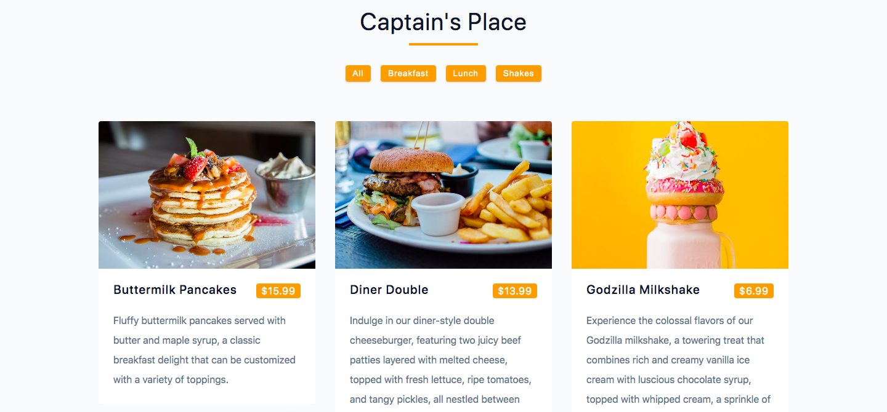

# Captain's Place



## Project Description

This `React.js` project is a dynamic menu application designed to provide a seamless user experience. Users can easily navigate through various menu items and filter them based on specific categories such as breakfast, lunch, and shakes. 

The menu items are beautifully presented with `HTML` and `CSS` styling, making it visually appealing and engaging for users to explore and make their selections.

## Important Links

- https://captainsplace.netlify.app/

### Setup Steps

1. [Fork and Clone](https://github.com/iamatos3/captains-place) this repository.
2. ```npm install```
3. ```npm run dev```

### Technologies Used

- Vite
- React.js
- HTML
- CSS